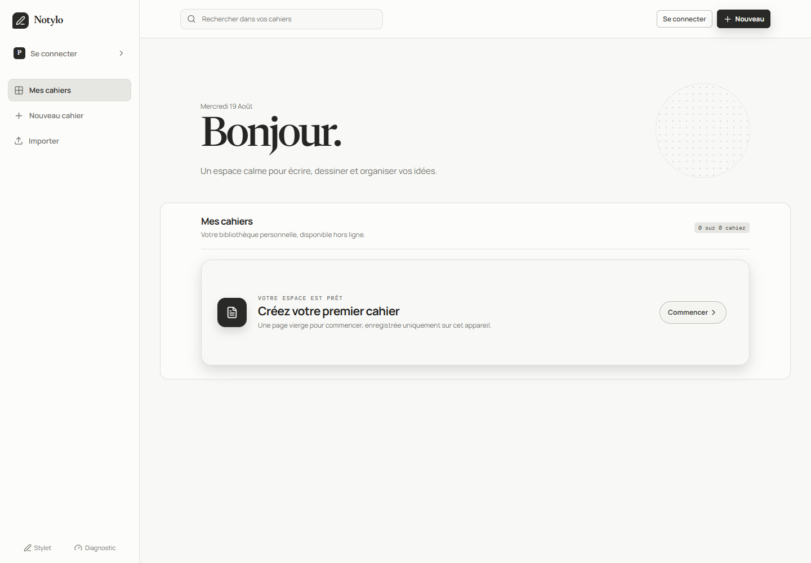
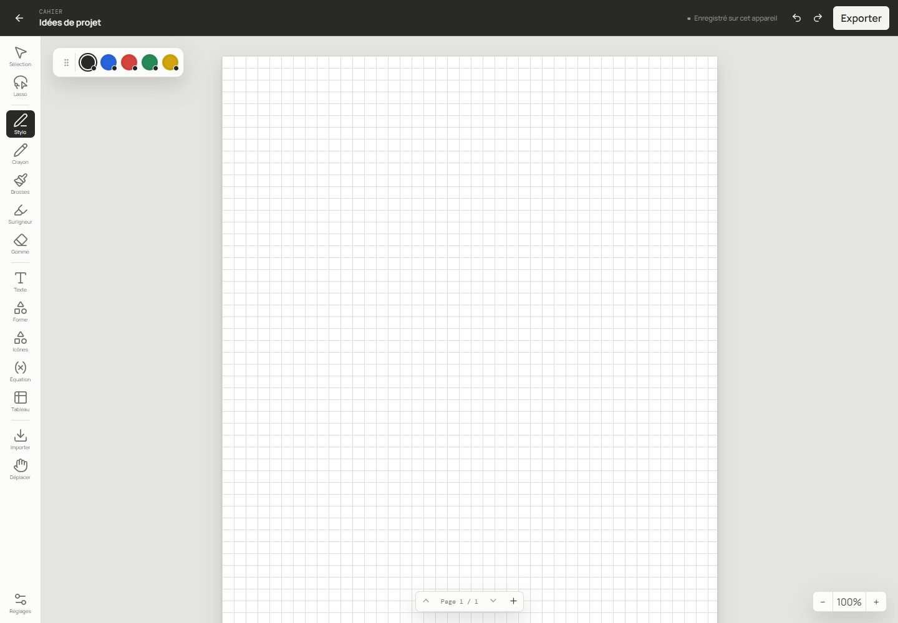
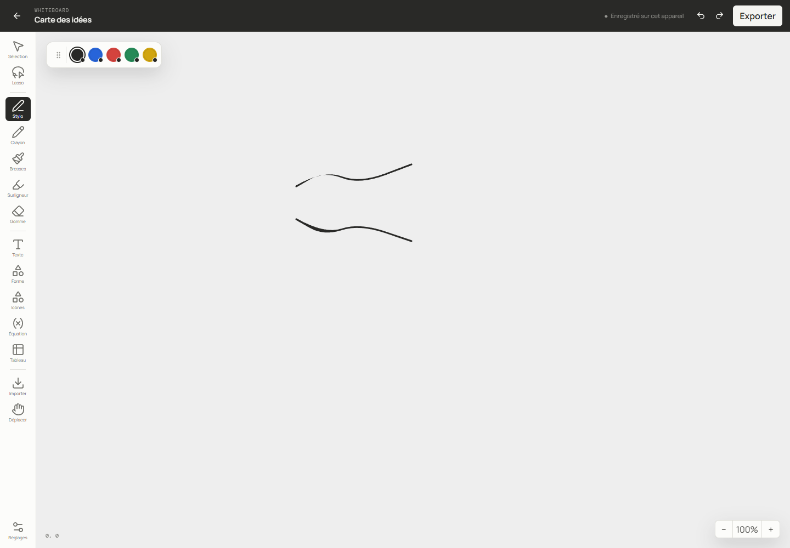

# Notylo

## Your space to write, draw and keep your ideas together

Notylo combines the comfort of a notebook, the freedom of a whiteboard and the simplicity of a personal workspace. Write with your keyboard, draw with a stylus or your finger, add images and organise your ideas without switching tools.

> **Notylo is currently in private beta.** To request access, email [contact@alexistb.com](mailto:contact@alexistb.com). You can also host Notylo yourself.



## What you can do

- Create notebooks for classes, projects, meetings or personal thoughts.
- Switch from a structured page to a free-form whiteboard whenever an idea needs more space.
- Write, draw, highlight, erase and move things naturally.
- Add text, shapes, tables, equations and images.
- Import documents and keep everything in one workspace.
- Quickly search your notebooks from the library.
- Keep working when your connection is unavailable.
- Export your notebooks so you always have a portable copy of your work.

## Designed for real ideas

Notylo is made for the moments when a sentence becomes a diagram, a list becomes a formula or a rough thought becomes an organised page.

The result is a calm, personal and flexible workspace for everyday note-taking, study sessions, planning and visual thinking.



## Notebook or whiteboard?

Use a notebook when you want to work page by page with a clear, familiar structure.

Choose a whiteboard when you want to place things freely, explore an idea, prepare a project or build a visual map.



## Your content stays under your control

Notylo is local-first: your notebooks are saved on the device you use and remain available offline. A private cloud space can be added when you want to access your notebooks from multiple devices.

Prefer to keep the entire installation at home or on your own server? You can [host Notylo yourself](https://github.com/alexistb2904/Notylo).

## Get access to the beta

Notylo is still being improved. Access is intentionally limited so we can collect feedback and shape the experience with its first users.

To receive an invitation, email [contact@alexistb.com](mailto:contact@alexistb.com).

You can simply include:

- what you would like to use Notylo for;
- which devices you would like to use;
- whether you prefer private access or self-hosting.

## Self-hosting

The source code and deployment files are available in the [Notylo GitHub repository](https://github.com/alexistb2904/Notylo). Self-hosting is intended for people who want full control over their installation, data and access.

## Project status

Notylo is in **beta**. The main features are already available, while the interface, imports and synchronisation continue to evolve. Feedback from beta users is welcome.

## Contact

[contact@alexistb.com](mailto:contact@alexistb.com)

---

# Installation tutorials

The two tutorials below are kept at the bottom of this README so the product overview stays easy to read.

## 1. Install Notylo without cloud services

This mode runs only the web application. Your notebooks stay on the device running the browser. No PostgreSQL, MinIO or API service is required.

### Requirements

- Node.js 24 or newer
- pnpm 11
- Corepack, included with recent Node.js versions

### Steps

Clone the repository and install its dependencies:

```
git clone https://github.com/alexistb2904/Notylo.git
cd Notylo
corepack enable
pnpm install --frozen-lockfile
```

Start the local-only application with authentication disabled.

PowerShell:

```powershell
$env:VITE_REQUIRE_AUTH = "false"
pnpm dev
```

macOS/Linux:

```bash
VITE_REQUIRE_AUTH=false pnpm dev
```

Open [http://localhost:5173](http://localhost:5173).

In this mode you can create notebooks, draw, edit, reload the browser and import or export supported files. The cloud account controls may show as unavailable; this does not prevent local note-taking.

To stop the application, press Ctrl+C in the terminal.

## 2. Install Notylo with private cloud services

This mode runs the web application together with PostgreSQL, MinIO and the Notylo API. It lets you create an account and synchronise notebooks between devices on your private installation.

### Requirements

- Node.js 24 or newer
- pnpm 11
- Corepack
- Docker Desktop or Docker Engine with Docker Compose

### Steps

Clone the repository and install its dependencies:

```
git clone https://github.com/alexistb2904/Notylo.git
cd Notylo
corepack enable
pnpm install --frozen-lockfile
```

Create a local environment file.

PowerShell:

```powershell
Copy-Item .env.example .env
```

macOS/Linux:

```bash
cp .env.example .env
```

The example file is suitable for local development. Start the cloud services:

```
docker compose up -d postgres minio api
```

In a second terminal, start the web application:

```
pnpm dev
```

Open [http://localhost:5173](http://localhost:5173), select **Create an account**, and sign in. The API is available locally at http://localhost:3001.

To stop the services without deleting their data:

```
docker compose down
```

To stop the services and delete the local database and object-storage volumes:

```
docker compose down -v
```

### Public self-hosting

For a public HTTPS deployment, use docker-compose.coolify.yml with Coolify or another Docker Compose host. Configure a real PostgreSQL database, strong secrets, the public CORS_ORIGIN, WEBAUTHN_RP_ID and WEBAUTHN_ORIGIN, then expose only the web service through HTTPS. Never use the development defaults on an internet-facing installation.
